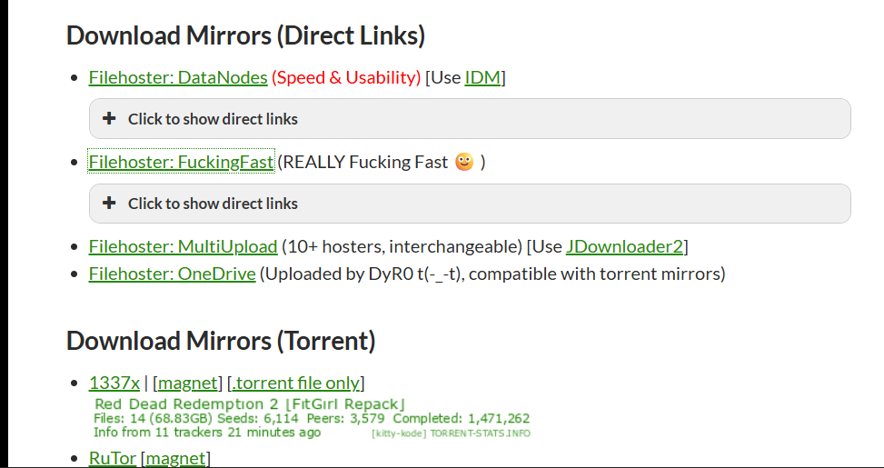
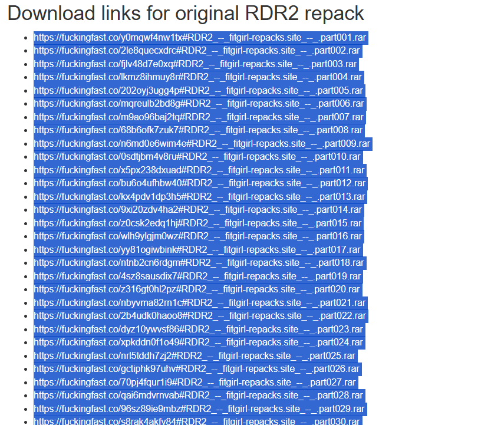

# FitGirl Downloader

**FitGirl Downloader** is a web-based project that explores an alternative approach to handling large file downloads through automation.

Traditionally, torrent-based downloads are the most common method for handling large files, but they can be slow, unreliable, or inconvenient depending on network conditions and the number of peers and seeds. This project proposes a different idea: instead of relying on torrents, users can simply paste links into a web interface, and the system automatically extracts all available direct download file links and prepares them for faster, organized downloading.

The focus of the project is on **automation, speed, and usability**. With a clean and visually appealing website, users can submit multiple links at once, track progress in real time, and download all extracted files without manual effort. The tool handles everything behind the scenes, turning a repetitive and time-consuming task into a smooth, one-click workflow.


## Key Highlights

-  Paste all links and automatically process all related files  
-  Faster, automated downloading compared to manual methods  
-  Bulk handling of multiple files without user intervention  
-  Live progress tracking, logs, and result summaries  
 

## Tech Stack

- **Frontend:** HTML, CSS, JavaScript  
- **Backend:** Python (Flask)  
- **Core Concepts:** Automation, web scraping, background processing, UI/UX design  


## Disclaimer

This project is created for **educational and technical demonstration purposes only**. Users are responsible for complying with website terms of service and applicable laws.


## How to Run

1. Install the required dependencies:
   ```bash
   pip install requirements.txt

2. Start the web application:
    ```bash
    python web_app.py

## How to use
    1. Select any games you want in the official website
    
    2. choose fuckingfast option
  
    3. Copy and paste all these link in the input box and then click 'Start Processing'.
    4. Links will be scrapped. Scroll and 'click Go to Auto Open'.
    5. Assume all the files will be equal to 500mb. Select the delay between download accordingly.
    6. click Start Auto-Open. 